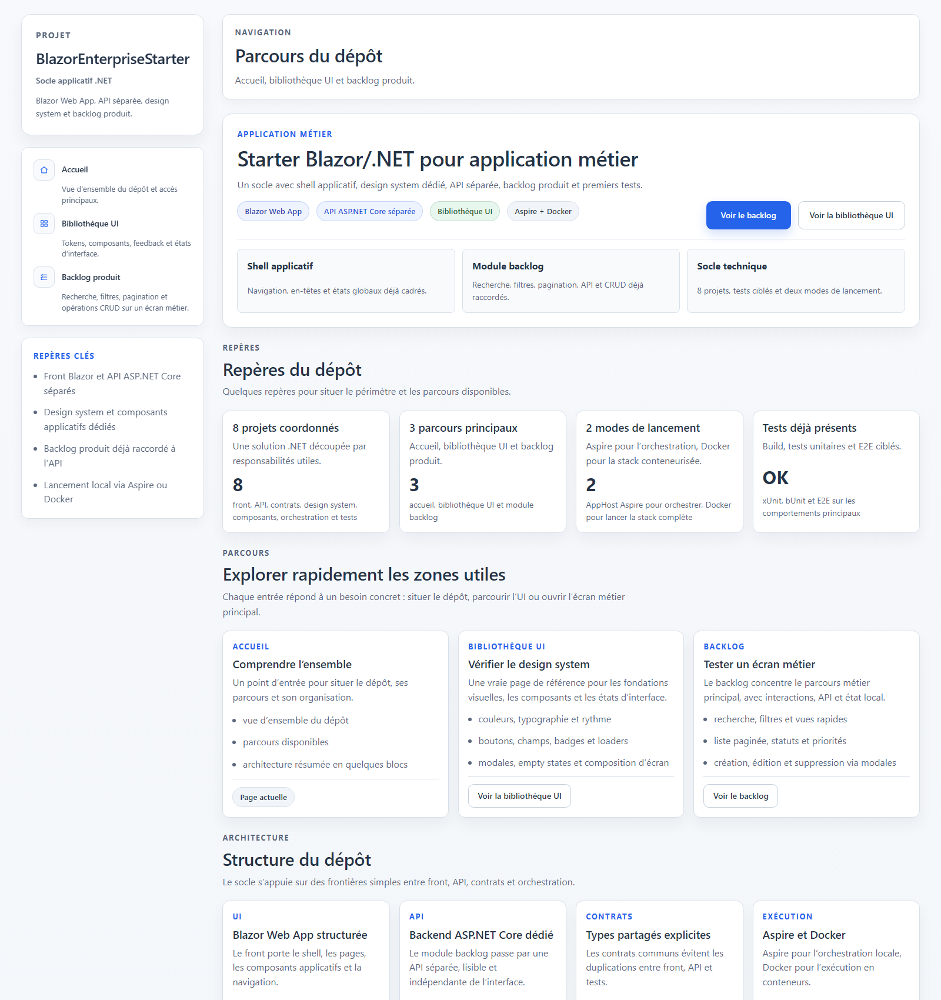
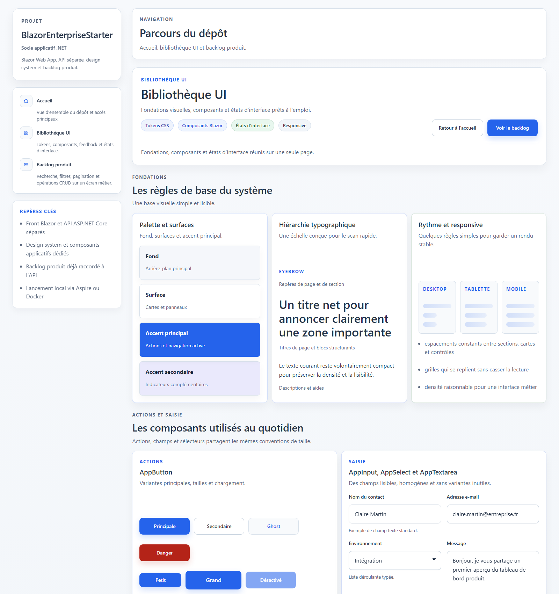
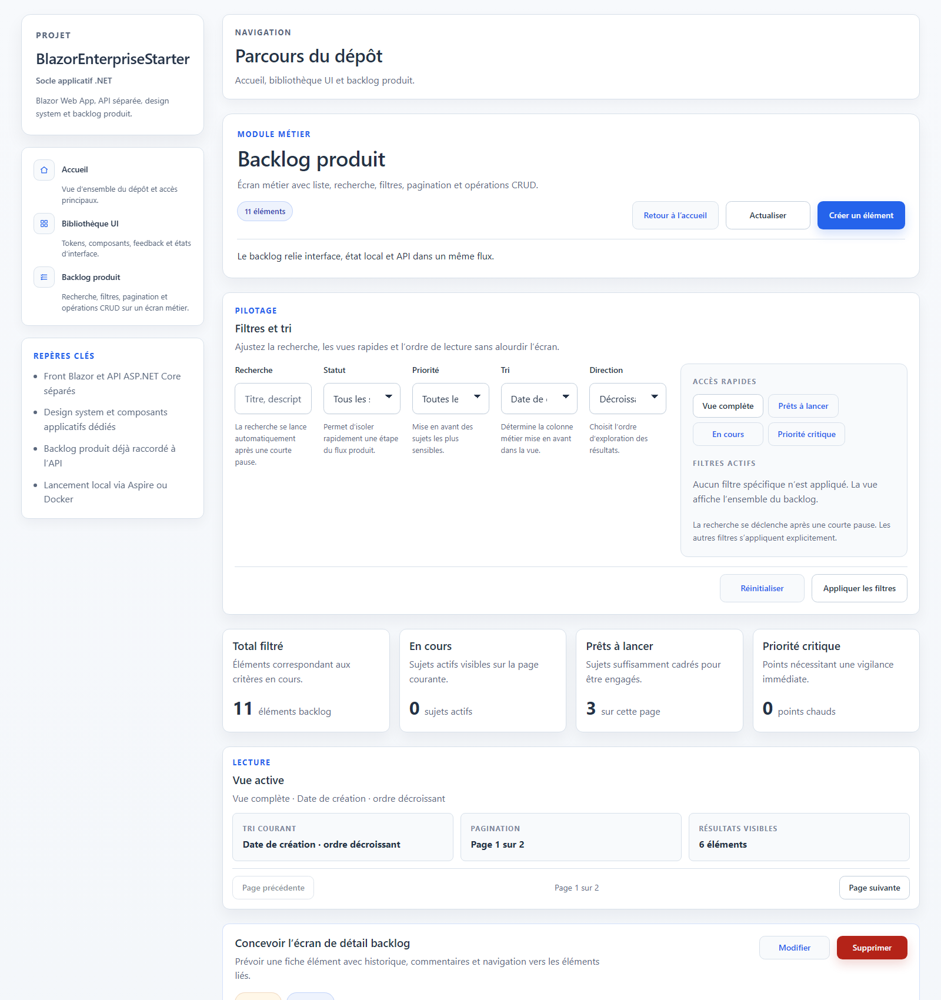

# BlazorEnterpriseStarter

Socle Blazor/.NET pour application métier, avec Blazor Web App, API ASP.NET Core séparée, design system dédié et module backlog déjà câblé.

## TL;DR

- Blazor Web App structurée pour un contexte métier
- API ASP.NET Core séparée
- design system et bibliothèque UI intégrés au dépôt
- module backlog avec recherche, filtres, pagination et CRUD
- lancement local via .NET Aspire ou Docker
- base de validation avec tests unitaires, composants et E2E ciblés

## Accès rapide

- Démo web : [Accueil](https://blazor.arnaudwissart.fr/), [Bibliothèque UI](https://blazor.arnaudwissart.fr/composants), [Backlog](https://blazor.arnaudwissart.fr/backlog)
- Lecture du dépôt : [Architecture](#architecture-de-la-solution), [Aperçu](#aperçu), [Validation locale](#validation-locale)
- Vérifications : [Tests end-to-end](#tests-end-to-end), [Intégration continue](#intégration-continue), [Lancement via Aspire](#lancement-via-aspire)

## Aperçu

- solution .NET multi-projets avec responsabilités explicites
- front Blazor, API backend et contrats partagés séparés
- bibliothèque UI et design system utilisés sur les pages du dépôt
- parcours métier complet autour d’un backlog produit
- orchestration locale via Aspire et exécution possible via Docker

## Architecture de la solution

```text
/src
  BlazorEnterpriseStarter.AppHost
  BlazorEnterpriseStarter.ServiceDefaults
  BlazorEnterpriseStarter.App
  BlazorEnterpriseStarter.Server
  BlazorEnterpriseStarter.Shared
  BlazorEnterpriseStarter.Components
  BlazorEnterpriseStarter.DesignSystem

/tests
  BlazorEnterpriseStarter.Tests
  BlazorEnterpriseStarter.E2ETests
```

### Rôle des projets

- `BlazorEnterpriseStarter.AppHost`
  Orchestration locale avec .NET Aspire et supervision des services.

- `BlazorEnterpriseStarter.ServiceDefaults`
  Configuration transverse pour la découverte de services, la résilience HTTP, la télémétrie et les endpoints de santé.

- `BlazorEnterpriseStarter.App`
  Application Blazor Web App et point d’entrée front-end.

- `BlazorEnterpriseStarter.Server`
  API ASP.NET Core pour les fonctionnalités backlog et la santé applicative.

- `BlazorEnterpriseStarter.Shared`
  Contrats partagés entre le front, l’API et les tests.

- `BlazorEnterpriseStarter.Components`
  Composants Blazor réutilisables orientés interface.

- `BlazorEnterpriseStarter.DesignSystem`
  Fondations visuelles, tokens CSS, layout et primitives UI.

- `BlazorEnterpriseStarter.Tests`
  Tests unitaires et composants sur les services, l’état local et les comportements principaux.

- `BlazorEnterpriseStarter.E2ETests`
  Scénarios Playwright dédiés à la validation visible et à la génération des captures.

- `.github/workflows/ci.yml`
  Pipeline GitHub Actions pour la compilation, les tests du dépôt et la validation Docker.

### Vue d’ensemble

```text
BlazorEnterpriseStarter.App
  -> consomme BlazorEnterpriseStarter.Components
  -> consomme BlazorEnterpriseStarter.DesignSystem
  -> consomme BlazorEnterpriseStarter.Shared
  -> appelle BlazorEnterpriseStarter.Server via client API dédié

BlazorEnterpriseStarter.Server
  -> consomme BlazorEnterpriseStarter.Shared
  -> expose les endpoints métier et de santé

BlazorEnterpriseStarter.AppHost
  -> orchestre App et Server via .NET Aspire
```

## Rôle des technologies

### Blazor

Blazor porte l’interface utilisateur, la structure applicative, les pages de référence et le module backlog. Le choix retenu ici est une `Blazor Web App` en mode `InteractiveServer`.

### ASP.NET Core

ASP.NET Core héberge l’API backend et les endpoints de santé. Le backlog y passe pour la recherche, le filtrage, le tri, la pagination et les opérations CRUD.

### Docker

Docker fournit un mode de lancement simple hors Aspire, avec deux conteneurs distincts pour le front et l’API.

### .NET Aspire

.NET Aspire est le mode principal d’orchestration locale. Il apporte la composition des services, la découverte de services et la supervision de base.

## Choix de conception principaux

### 1. Front-end, backend et contrats séparés

Le front Blazor, l’API ASP.NET Core et les contrats partagés vivent dans des projets distincts. Ce découpage garde la lecture simple et limite le couplage.

### 2. Design system distinct de la bibliothèque de composants

Le design system porte les fondations visuelles. Les composants les composent ensuite pour répondre à des usages concrets.

### 3. Gestion d’état pragmatique sur le module backlog

Le backlog s’appuie sur :

- un client API dédié
- une classe d’état locale
- des notifications explicites de changement
- des états `chargement`, `succès` et `erreur`

L’objectif est de garder un flux compréhensible rapidement, sans ajouter une couche de state management plus lourde.

### 4. Persistence SQLite légère

Le backlog repose sur `SQLite` via `Entity Framework Core`.

Le choix reste volontairement simple :

- aucun service externe requis
- base créée automatiquement au démarrage
- seed initial injecté uniquement si la base est vide
- `DbContext` et dépôt dédiés au module backlog

### 5. Optimisations limitées aux gains utiles

Le projet retient quelques optimisations ciblées :

- pagination serveur
- debounce sur la recherche
- conservation des résultats déjà chargés lors d’un rafraîchissement échoué
- retours visuels de chargement sobres

### 6. Garde-fous de saisie et sécurité de base

Le dépôt applique les garde-fous attendus sur ce périmètre :

- validation côté interface
- validation côté API
- normalisation des saisies avant persistence
- rejet des caractères de contrôle non pris en charge
- rendu Razor sans HTML brut injecté
- antiforgery activé côté application Blazor

## Interface

Pages mises en avant :

- `/`
  Vue d’ensemble du dépôt, de ses parcours et de son socle technique

- `/composants`
  Fondations visuelles, composants et états d’interface

- `/backlog`
  Parcours métier avec recherche, filtres, pagination et CRUD

## Instructions de lancement

### Prérequis

- SDK .NET 10
- Docker Desktop pour le lancement en conteneurs
- workload Aspire pour le lancement via AppHost

### Lancement via Aspire

```bash
dotnet run --project src/BlazorEnterpriseStarter.AppHost
```

La base SQLite du backlog est créée automatiquement dans :

- `src/BlazorEnterpriseStarter.Server/data/blazor-enterprise-starter.db`

Ports attendus en développement :

- application Blazor : `https://localhost:7196` et `http://localhost:5184`
- API ASP.NET Core : `https://localhost:7005` et `http://localhost:5036`

### Lancement via Docker

```bash
docker compose up --build
```

Ports exposés :

- application Blazor : `http://localhost:8080`
- API ASP.NET Core : `http://localhost:8081`

Le front contacte alors l’API via l’URL interne `http://server:8080`.

Pour arrêter les conteneurs :

```bash
docker compose down
```

### Vérifications utiles

- Front : `http://localhost:8080` en mode Docker
- API backlog : `http://localhost:8081/api/backlog-items` en mode Docker
- Santé : `http://localhost:8081/health` en mode Docker

### Validation locale

```bash
dotnet build BlazorEnterpriseStarter.sln
dotnet test BlazorEnterpriseStarter.sln
dotnet build tests/BlazorEnterpriseStarter.E2ETests/BlazorEnterpriseStarter.E2ETests.csproj
docker compose config
```

## Documentation persistence

Les choix autour de SQLite sont détaillés dans :

- `docs/persistence-sqlite.md`

## Tests end-to-end

Une documentation dédiée est disponible dans :

- `docs/tests-e2e-playwright.md`

Installation du navigateur utilisé :

```powershell
pwsh ./scripts/install-playwright.ps1
```

Exécution des scénarios E2E :

```powershell
pwsh ./scripts/test-e2e.ps1
```

## Intégration continue

Le dépôt inclut une CI GitHub Actions volontairement simple :

- compilation de la solution
- exécution des tests unitaires et composants
- compilation du projet E2E
- validation de `docker compose config`

## Captures d’écran

Les visuels versionnés sont stockés dans `docs/screenshots`. Trois captures sont générées automatiquement via le projet E2E existant :

- accueil : `docs/screenshots/home-overview.png`
- bibliothèque UI : `docs/screenshots/components-library.png`
- backlog : `docs/screenshots/backlog-module.png`

Régénération :

```powershell
pwsh ./scripts/capture-screenshots.ps1
```

Si Playwright n’est pas encore installé localement :

```powershell
pwsh ./scripts/install-playwright.ps1
```

### Accueil



### Bibliothèque UI



### Backlog



### AppHost / Supervision

La capture `docs/screenshots/apphost-dashboard.png` reste manuelle.

Dans l’état actuel du dépôt, son automatisation demanderait de lancer l’AppHost Aspire puis de récupérer un jeton de connexion éphémère exposé au démarrage.

Procédure manuelle :

1. lancer `dotnet run --project src/BlazorEnterpriseStarter.AppHost`
2. ouvrir l’URL du dashboard Aspire affichée par l’AppHost
3. attendre que `app` et `server` apparaissent dans l’écran de supervision
4. capturer la vue d’ensemble du dashboard
5. enregistrer l’image sous `docs/screenshots/apphost-dashboard.png`

## Pistes d’évolution

- introduire des migrations EF Core versionnées si le backlog gagne en profondeur
- ajouter une authentification et une gestion des rôles
- enrichir le backlog avec commentaires, affectations ou workflows
- étendre les tests de composants Blazor avec bUnit
- compléter la stratégie de déploiement

## Documentation complémentaire

- `docs/audit-technique-2026-04.md`
- `docs/positionnement-blazor.md`
- `docs/persistence-sqlite.md`
- `docs/tests-e2e-playwright.md`
